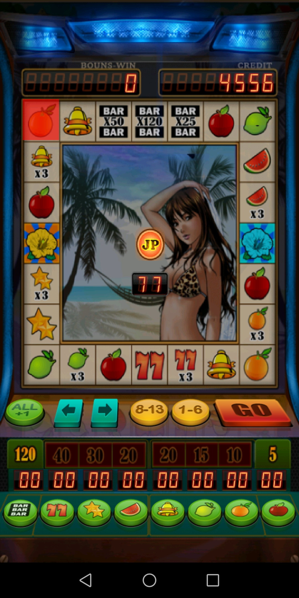
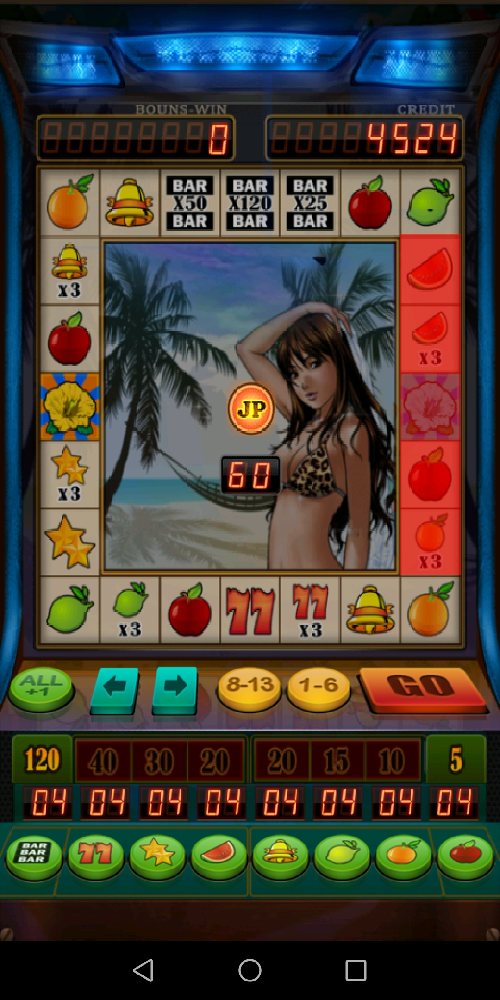
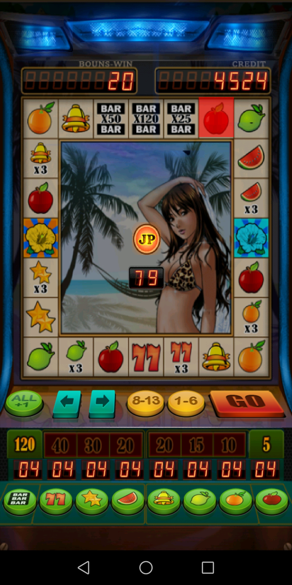
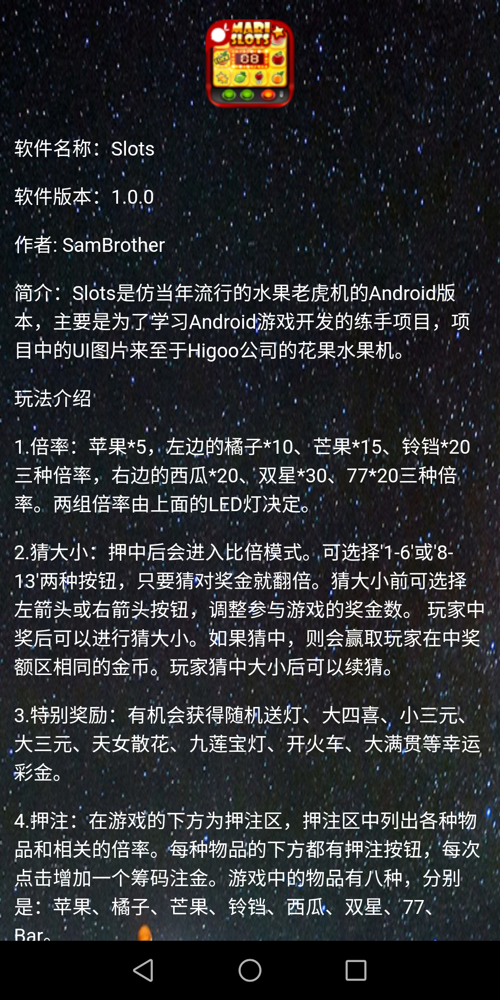

# Slot
仿花果水果机

### 喜欢的请给🙏个Star ☆☆☆☆☆ 再走！！🏃
> 该游戏是单机版本，即无联网及蓝牙联机功能，如需上述功能，自行download代码添加哈！后期会进行Kotlin及Flutter版本的重构，如果有空的话！！🤪🤪🤪
> 游戏的主界面采用的是Android原生系统自带的SurfaceView游戏框架结构(如果有大佬问为啥不用其他流行引擎，🙈不会，懒，能力不足)。
> 游戏难点主要集中在游戏运行跑圈及中奖时的界面绘制和得分显示的逻辑实现上，其他操作均为常规操作。

# app运行效果图
+ Gif效果图 

+ 各分页效果图

xx|xx|xx|xx|
|:--:|:--:|:--:|:--:|
||||
||||
||
